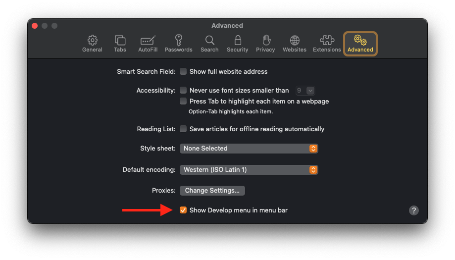
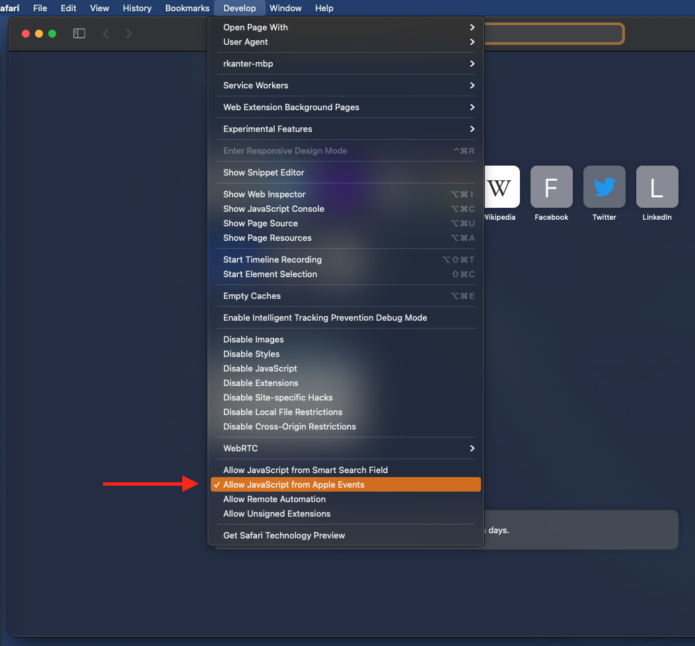

Allow JavaScript From Apple Events
==================================

## What does this do?
Step 2 adds an extra menu to Safari that's meant more for developers (hence the name "Develop") which includes a bunch
of technical options that everyday users don't need to worry about.  There's nothing wrong with leaving this enabled,
just be aware that clicking certain options in there may break some webpages.

Step 4 is a potential security risk.  It allows an Applescript to execute Javascript on any webpage in Safari.
Javascript can pretty much do anything, so you really don't want to be (or allowing someone else to be) running
arbitrary Javascript on any page in your web browser.  I recommend disabling this when you're done running the
Applescript in this repo.  In fact, you should look at it and make sure it's not doing anything malicious; though, trust
me, it's not 😉.

Anyway, the Applescript needs this permission because it runs a very short amount of Javascript to figure out the name
of the currently selected recipe.

## Instructions

1. Open Safari and go to Preferences

2. Under "Advanced", click "Show Develop menu in menu bar":\
   

3. Close the Preferences window

4. There should now be a "Develop" menu item.  Click it and then "Allow JavaScript from Apple Events":\
   

